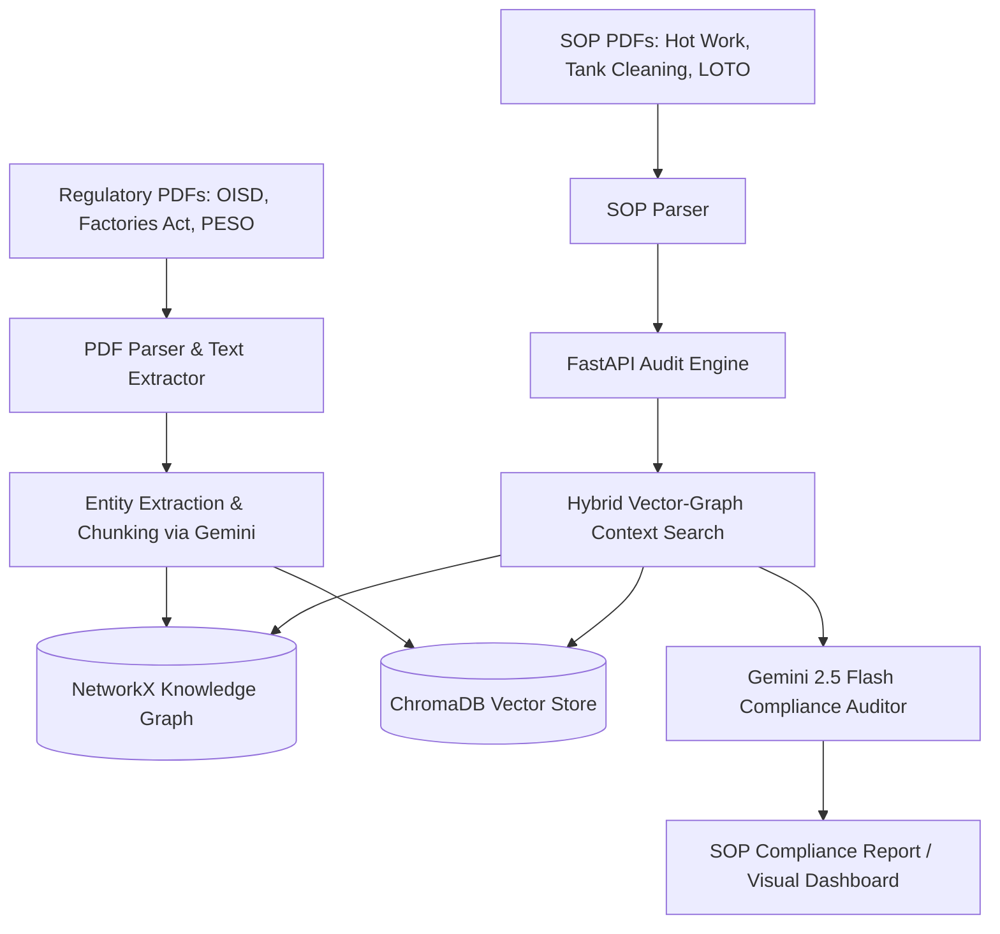

# 🛡️ SafeFlow AI: Unified Asset & Operations Brain
### *AI-Powered Industrial Safety Compliance & Regulatory Auditing Hub*

[](https://www.python.org/)
[](https://fastapi.tiangolo.com/)
[](https://ai.google.dev/)
[](https://opensource.org/licenses/MIT)

SafeFlow AI is a production-grade, state-of-the-art solution designed for **Problem Statement 8: AI for Industrial Knowledge Intelligence: Unified Asset & Operations Brain**. 

It transforms static, complex industrial regulatory standards (like the Factories Act, OISD, and PESO guidelines) into a dynamic, connected **Knowledge Graph**. By combining **Vector Databases** with **Graph Networks (Hybrid RAG)**, SafeFlow AI automatically audits Standard Operating Procedures (SOPs), calculates compliance scores, highlights critical safety gaps, and recommends precise, regulation-aligned rewrites.

---

## 🚀 Key Features

* **📋 Automated SOP Auditing**: Upload or select an industrial SOP and get an instant compliance score (0-100%) with automated gap detection.
* **🌐 Interactive Safety Knowledge Graph**: A visual, interactive map (built with Vis.js and NetworkX) linking safety regulations, equipment, hazardous roles, and operational procedures.
* **🔍 Hybrid RAG Query Engine**: Combines **Vector Similarity (ChromaDB)** and **Graph Traversal (NetworkX)** to retrieve precise regulatory context, eliminating LLM hallucinations.
* **💡 AI-Powered Safety Recommendations**: Leverages **Gemini 2.5 Flash** to provide compliant SOP rewrites and severity-level ratings (Critical, Major, Minor) for safety violations.
* **💎 Premium Glassmorphism UI**: A fully responsive, modern web dashboard with clean animations, dark mode, and an embedded Node Inspector.

---

## 📐 System Architecture

SafeFlow AI operates on a two-layer intelligence engine:



1. **Knowledge Ingestion Layer (`ingest.py`)**:
   - Parses regulatory guidelines and extracts chunks, semantic entities (Equipment, Hazard, Role, Procedure), and their relationships.
   - Builds and serializes a NetworkX graph (`data/knowledge_graph.pkl`).
   - Indexes text chunks in ChromaDB for high-dimensional semantic search.

2. **Compliance & Query Layer (`main.py`)**:
   - Executes hybrid searches (combining cosine similarity matching from ChromaDB and relation traversal in the Graph).
   - Generates structured JSON compliance findings using Gemini 2.5 Flash with custom Pydantic schemas.

---

## 🛠️ Tech Stack

* **Backend Framework**: [FastAPI](https://fastapi.tiangolo.com/) (Python)
* **LLM & Embeddings**: [Google GenAI SDK](https://github.com/google/generative-ai-python) (`gemini-2.5-flash` & `gemini-embedding-2`)
* **Graph Database**: [NetworkX](https://networkx.org/)
* **Vector Store**: [ChromaDB](https://www.trychroma.com/)
* **PDF Parser**: [PyMuPDF (Fitz)](https://pymupdf.readthedocs.io/)
* **Frontend Visualization**: [Vis.js Network](https://visjs.github.io/vis-network/)
* **UI/UX**: HTML5, Vanilla CSS3 (Glassmorphism design, Inter & Outfit typography), FontAwesome Icons

---

## 📦 Installation & Setup

### Prerequisites
* Python 3.10+
* Git
* A Gemini API Key (get one from [Google AI Studio](https://aistudio.google.com/))

### 1. Clone & Set Up Directory
```bash
git clone https://github.com/Sara-nya-M/ET-AI.git
cd ET-AI
```

### 2. Configure Environment Variables
Create a `.env` file in the root directory:
```env
GEMINI_API_KEY=your_gemini_api_key_here
```

### 3. Install Dependencies
```bash
pip install -r requirements.txt
```

### 4. Ingest Regulations and Generate Graph
Before running the dashboard, ingest the regulatory documents to populate the database and build the graph:
```bash
python ingest.py
```

### 5. Launch the Dashboard
```bash
python main.py
```
Open your browser and navigate to **`http://127.0.0.1:8000`** to view the app!

---

## 📂 Project Structure

```
ET-AI/
│
├── data/
│   ├── db/                     # Local ChromaDB Vector Store
│   ├── regulations/            # PDF guidelines (OISD, Factories Act, PESO)
│   ├── procedures/             # Company SOPs (LOTO, Tank Cleaning, Hot Work)
│   └── knowledge_graph.pkl     # Serialized NetworkX Graph Database
│
├── static/                     # Frontend Assets
│   ├── index.html              # Main Dashboard Template
│   ├── style.css               # Premium Glassmorphism Theme
│   └── app.js                  # Frontend logic & Vis.js Graph Rendering
│
├── main.py                     # FastAPI backend & Compliance Audit endpoints
├── ingest.py                   # Data ingestion, embedding, and Knowledge Graph builder
├── requirements.txt            # Python Dependencies
├── generate_docs.py            # Script to generate synthetic safety PDFs
└── README.md                   # Project Documentation (this file)
```

---

## 🛡️ License

Distributed under the MIT License. See `LICENSE` for more information.
